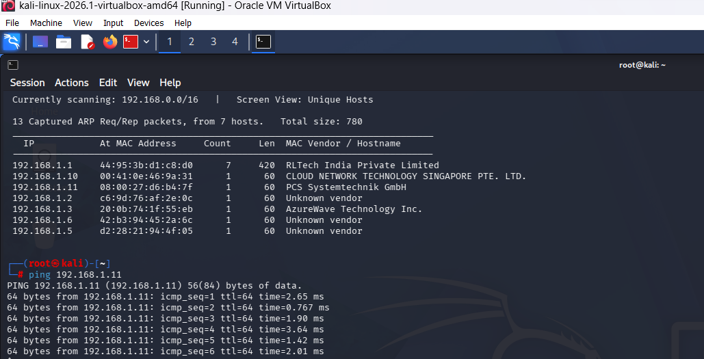

# 🔐 Sunset: DC-1

## 📌 Overview

Sunset: DC-1 is a Linux-based penetration testing lab completed in a controlled environment as part of my cybersecurity learning journey. This lab provided practical experience in information gathering, service enumeration, and Linux system analysis.

---

## 🎯 Objective

- Perform information gathering and enumeration.
- Identify open ports and running services.
- Analyze exposed services.
- Gain initial access in a controlled lab environment.
- Improve practical penetration testing skills.

---

## 🛠️ Tools Used

- Kali Linux
- Nmap
- FTP
- SSH
- Linux Terminal

---

## 💡 Skills Practiced

- Information Gathering
- Network Enumeration
- Service Enumeration
- Linux Enumeration
- Vulnerability Assessment
- Problem Solving

---

## 📸 Lab Screenshots

### 1️⃣ Host Discovery & Connectivity

The target machine was identified using **Netdiscover**, and connectivity was verified using **Ping**.

---

### 2️⃣ Service & OS Detection (Nmap -sV -O)

Performed an Nmap scan to identify open ports, running services, and the target operating system.

---

### 3️⃣ Aggressive Scan (Nmap -A)

Performed an aggressive scan to gather additional information about services and the target system.

---

### 4️⃣ FTP Enumeration

Enumerated the FTP service to identify accessible resources within the lab environment.

---

### 5️⃣ SSH Access

Established SSH access to continue the assessment within the authorized lab environment.

---

## 📖 Key Takeaways

- Learned the importance of systematic enumeration.
- Improved understanding of Linux-based penetration testing.
- Strengthened practical experience with Nmap, FTP, and SSH.
- Enhanced analytical thinking and problem-solving skills.

---

## ⚠️ Disclaimer

This lab was completed in an authorized environment for educational purposes only. No unauthorized systems or networks were targeted.
